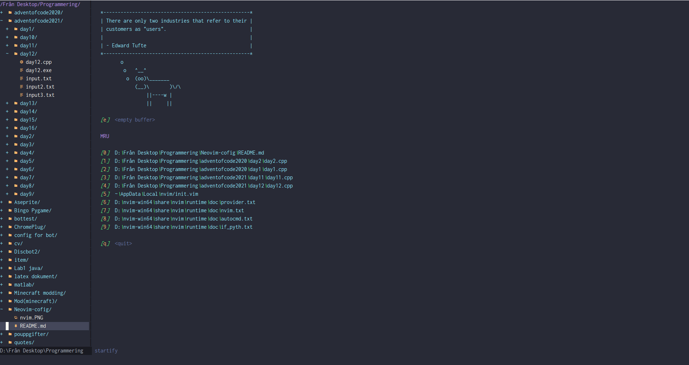

# Neovim-config

A readme for when I forget how to do this.

Note:
Make sure you have Python3 and Nodejs installed.
Also download a [Nerd Font](https://www.nerdfonts.com/font-downloads)(for the devicons to work). I chose Inconsolata.




1. Open Neovim
2. Run:
```
:call mkdir(stdpath('config'), 'p')
:exe 'edit '.stdpath('config').'/init.vim'
```
3. If on windows, make sure python3 is installed and can be executed by running python3 in terminal
4. If on Windows run the following:
```
iwr -useb https://raw.githubusercontent.com/junegunn/vim-plug/master/plug.vim |`
    ni $HOME/vimfiles/autoload/plug.vim -Force
```
If on Linux(Flatpak):
```
curl -fLo ~/.var/app/io.neovim.nvim/data/nvim/site/autoload/plug.vim --create-dirs \
    https://raw.githubusercontent.com/junegunn/vim-plug/master/plug.vim
```

If these fail, [go here](https://github.com/junegunn/vim-plug)

5. Add the following to init.vim:
```
set nocompatible            " disable compatibility to old-time vi
set showmatch               " show matching 
set ignorecase              " case insensitive 
set mouse=v                 " middle-click paste with 
set hlsearch                " highlight search 
set incsearch               " incremental search
set tabstop=4               " number of columns occupied by a tab 
set softtabstop=4           " see multiple spaces as tabstops so <BS> does the right thing
set expandtab               " converts tabs to white space
set shiftwidth=4            " width for autoindents
set autoindent              " indent a new line the same amount as the line just typed
set number                  " add line numbers
set wildmode=longest,list   " get bash-like tab completions
filetype plugin indent on   "allow auto-indenting depending on file type
syntax on                   " syntax highlighting
set mouse=a                 " enable mouse click
set clipboard=unnamedplus   " using system clipboard
filetype plugin on
set cursorline              " highlight current cursorline
inoremap <silent><expr> <CR> coc#pum#visible() ? coc#pum#confirm() : "\<CR>"
set ttyfast                 " Speed up scrolling in Vim
call plug#begin()
 Plug 'Mofiqul/dracula.nvim'
 Plug 'ryanoasis/vim-devicons'
 Plug 'SirVer/ultisnips'
 Plug 'honza/vim-snippets'
 Plug 'scrooloose/nerdtree'
 Plug 'preservim/nerdcommenter'
 Plug 'mhinz/vim-startify'
 Plug 'neoclide/coc.nvim', {'branch': 'release'}
call plug#end()
colorscheme dracula
```
6. Restart Neovim
7. Execute
```
:PlugInstall
```
Then
```
:PlugUpdate
```
for good measure.

8. Restart again

9. Run
```
:checkhealth provider
```
and follow instructions there if errors are occuring.
If on Windows, you probably need to follow the steps in:
```
:h provider-python
```
10. If everything seems to work, run:
```
:NERDTree
```
and navigate to where you want it to default when starting Neovim. Then, run:
```
:Bookmark "NameOfBookmark"
```
Without quotation marks!!.I set "NameOfBookmark" to "code"

11. Add these to init.vim (at the bottom, don't know if order matters here):
```
autocmd VimEnter * Startify
autocmd VimEnter * NERDTree code
```
where, "code" is "NameOfBookmark".
